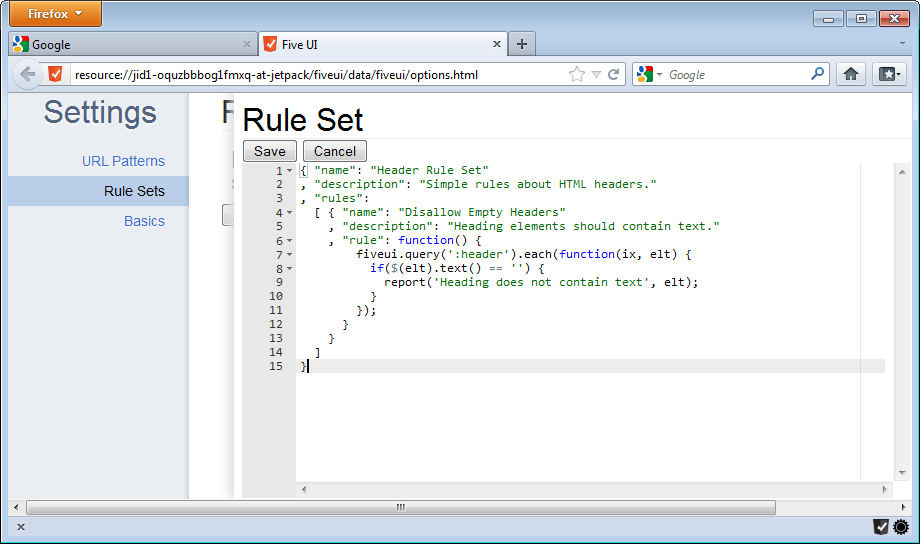
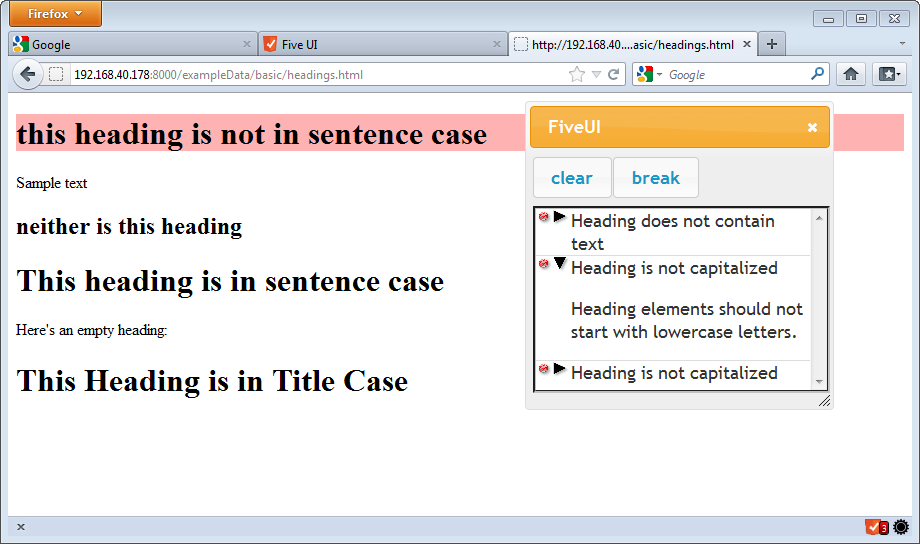

% Getting Started with FiveUI

# Configuring FiveUI

Once FiveUI has been installed, some initial configuration will need to be done
to make the extension useful.

The options page allows the user to configure `URL Patterns` that will apply
when the browser is navigating to new URLs, and `Rule Sets` which categorize
user interface guidelines into named groups.

## Options in Chrome

The options page in `Chrome` can be accessed either through the
options link on the extensions page, or through the options item on
the context menu off of the FiveUI button (accessed by right-clicking
on the FiveUI button).

## Options in FireFox

The options page in `FireFox` can be accessed via the FiveUI gear widget, which
should be added in addition to the FiveUI widget when the addon is installed.
Once clicked, a new tab should appear which serves as the options interface for
the addon.

The FiveUI Widgets are initially placed on the Firefox `Add-on bar`,
as shown in the figure.


# The Options Page

The options page allows the user to configure `URL Patterns` that will apply
when the browser is navigating to new URLs, and `Rule Sets` which categorize
user interface guidelines into named groups.  As it's required that one or more
`Rule Sets` already exist to create a `URL Pattern`, let's start with the `Rule
Sets` tab.

## Rule Sets

`Rule Sets` can be managed by clicking on the `Rule Sets` tab on the left-hand
side of the options page.

`Rule Sets` in FiveUi are specified as a json-like object that
contains javascript functions for the rule implementations.  Each
`Rule Set` contains a **name**, **description** and list of zero or
more **rules**.  The following snippet exhibits the minimal definition
for a `Rule Set`, providing only the **name** and **description**
fields, along with an empty set of **rules**.

```javascript
{ "name": "Empty Rules"
, "description": "An example of an empty rule set"
, "rules": []
}
```

### Rules

The elements of the **rules** array in the `Rule Set` are also represented as
json objects.  A minimal rule consists of three fields: **name**,
**description** and **rule**.  While **name** and **description** are just
strings, like the definition of a `Rule Set`, the **rule** field is a javascript
function.

The definition of the **rule** function consists of a single javascript function
that expects no arguments and returns no value.  The rule will be invoked with
no special context, and it is expected to perform its validation based on uses of
the `FiveUI prelude`.  Rules are able to report problems to the in-page FivUI
interface by invoking the *report* function.

As a simple example, the following rule will log an error for each header tag
that contains no text:

```javascript
{ "name": "Disallow Empty Headers"
, "description": "Heading elements should contain text"
, "rule": function() {
    fiveui.query(':header').each(function(ix, elt) {
      if($(elt).text() == '') {
        report('Heading does not contain text', elt);
      }
    });
  }
}
```

### Creating a `Rule Set`

Reusing the previous example and the skeleton of the first, we can create a
simple `Rule Set` that applies the empty header rule:

* Begin by copying this code block, so that it will be available to the `Rule
   Set` editor later.

```javascript
{ "name": "Header Rule Set"
, "description": "Simple rules about HTML headers."
, "rules":
  [ { "name": "Disallow Empty Headers"
    , "description": "Heading elements should contain text."
    , "rule": function() {
        fiveui.query(':header').each(function(ix, elt) {
          if($(elt).text() == '') {
            report('Heading does not contain text', elt);
          }
        });
      }
    }
  ]
}
```

* Next, open the options page for the FiveUI extension.
* Navigate to the `Rule Sets` preferences tab, by clicking the `Rule Sets` link
  on the left-hand side of the page.
* Click the `Add` button.
* Paste in the contents of the example Rule Set into the text area that appears.
  FiveUI should highlight the syntax of the rule.



* Click the `Save` button.
* An entry in the list above the `Add` button should appear, describing the rule
  that was added in the previous steps.

## URL Patterns

`URL Patterns` can be managed by first clicking the `URL Patterns` tab on the
left-hand side of the options page.

`URL Patterns` represent the conditions in which a `Rule Set` will be applied to
a page.  To create a `URL Pattern` first make sure that you have created a `Rule
Set` with the instructions above.  If not, when you click the `Add` button on
the `URL Patterns` tab, you will get an error dialog explaining that it is not
possible to create a `URL Pattern` without one or more `Rule Sets` having been
defined.

If you have created a `Rule Set`, a new tab should appear that
contains two fields, one text box for the rule pattern and a drop-down
menu that contains all of the `Rule Sets` that have been defined thus
far.

### Pattern Language

The **pattern** text in a `URL Pattern` uses the glob character
`*`, to allow for a `URL Pattern` to apply to many URLs.  For example, if you
would like to design a pattern that applies to all of the `http` pages under the
www.example.com domain, then you could use a pattern such as:

```
http://www.example.com*
```

Note that `URL Patterns` match the protocol, domain, port and path
portions of the url, so the pattern above will not apply to `https`
urls.  The following pattern will apply to *any* site hosted at example.com:

```
*example.com*
```

# Using FiveUI

Once some `Rule Sets` and `URL Patterns` exist in the FiveUI configuration, the
rules can be applied to a web page.  Start off by navigating to a page that
satisfies one of the `URL Patterns` defined in the FiveUI options page.  If that
URL is matched by one of the patterns, the FiveUI icon will change from gray to
red, and an overlay will display the number of rule violations present on the
page.

The primary user interface is hidden by default, to avoid obscuring
the web page inadvertently.  To show the list of problems, simply
click on the FiveUI icon to make the window visible.  The user
interface is injected into the running page, and it should display on
top of any other user interface elements present.

As the user navigates around sites that are matched by `URL Patterns`,
the problem list will have newly occurring problems appended to it.
All state in the dialog is maintained by the extension on a per-tab
basis, so different browser tabs can have distinct lists of problems.

## Problems

Problem entries will be added to the FiveUI dialog as rules report
problems on the page.  Once a problem is reported, the user can click
on the arrow to the left of the message to both expand the description
of the problem, and to highlight the node of the DOM that is causing
the problem.  One caveat to this is that if the node that generated
the problem exists on a page that has since been navigated away from,
the node will obviously not be highlighted.

We illustrate this by first adding a new rule to our example Rule Set.
This rule identifies headers that start with a lower-case letter.

```javascript
{ "name": "Header Rule Set"
, "description": "Simple rules about HTML headers."
, "rules":
  [ { "name": "Disallow Empty Headers"
    , "description": "Heading elements should contain text."
    , "rule": function() {
        fiveui.query(':header').each(function(ix, elt) {
          if($(elt).text() == '') {
            report('Heading does not contain text', elt);
          }
        });
      }
    },
    { "name": "Headers should be capitalized"
    , "description": "Heading elements should not start "
                   + "with lowercase letters."
    , "rule": function() {
        fiveui.query(':header').each(function(ix, elt) {
          if( !fiveui.word.capitalized($(elt).text()) ) {
            report('Heading is not capitalized', elt);
          }
        });
      }
    },
  ]
}
```

This sample `Rule Set` demonstrates some new capabilities:
 * Multiple rules in one Rule Set.
 * Multi-line descriptions.
 * The `fiveui.word.capitalized(...)` predicate, from the `FiveUI prelude`.
The `FiveUI Prelude` is a small collection of utilities for creating rules.

Once adding this `Rule Set` specifying a `URL Pattern`, we can view
violations in the FiveUI Problem List.  Clicking on the `expand arrow`
for a specific problem will highlight the element of the DOM that
caused the violation.


