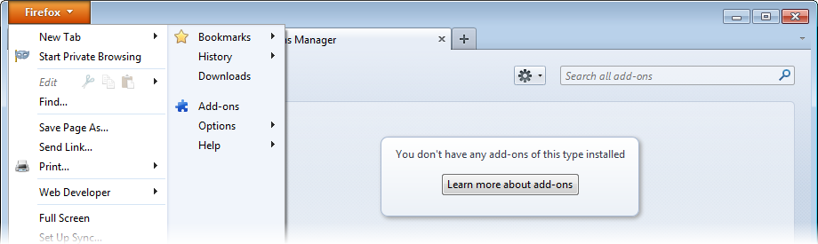
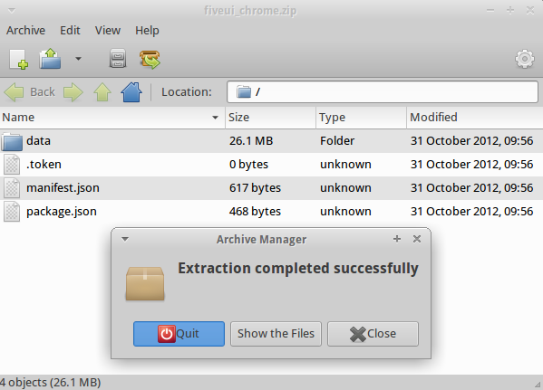
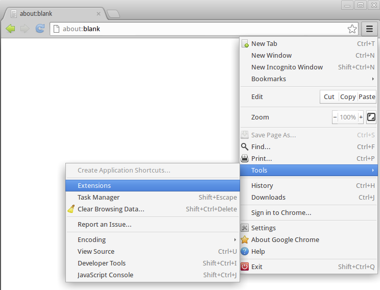
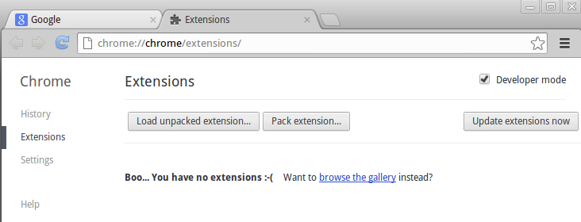
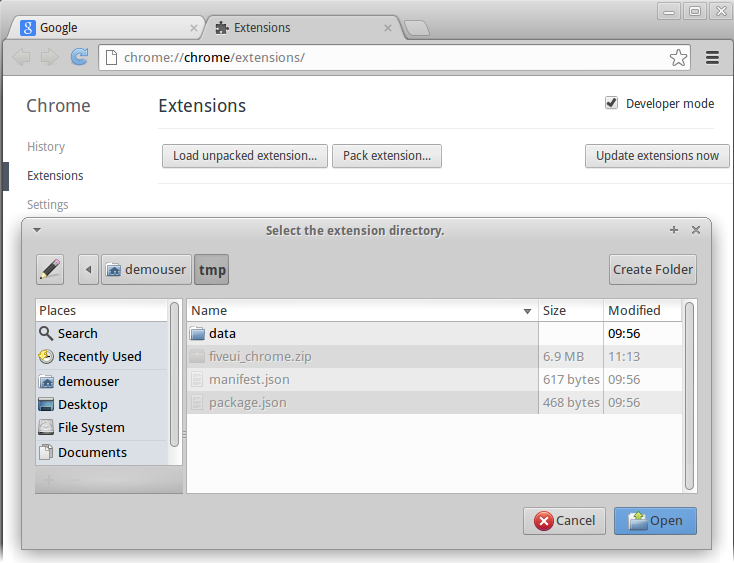

% Install Guide

# Installing the FiveUI Extension

FiveUI is distributed as source code and as a browser extension for
both Google Chrome and Mozilla Firefox.  This document describes the
install process for these browsers, assuming that you have the FiveUI
extension on your local computer.

## Installing FiveUI in Firefox

FiveUI is currently supported on Firefox 10, although it should also
work on newer versions and Firefox 3.6.  Due to changes in the
long-term support and Mozilla version numbering scheme, versions 4-9
are not supported.

The FiveUI Firefox extension is packaged in a file called
`fiveui.xpi`.  Locate this file in your distribution (or download) and
take note of the location for the following steps.  We will assume
that it is located at `d:\binaries\fiveui.xpi`

 * Open Firefox, and load the `Add-ons Manager` from the main Firefox
   menu.




 * Within the `Add-ons Manager`, open the Gear menu and select
   `Install Add-on From File`.

 * A file dialog should open, use this to browse to the `fiveui.xpi`
   file (in our case, `d:\binaries\fiveui.xpi`.

 * Click OK, and a warning dialog should appear.  This dialog warns
   that the FiveUI author is not verified.  Because this is a
   development release of FiveUI, the xpi file is not
   cryptographically signed, and therefore, Firefox is unable to
   verify the author identification.

 * Click on the `Install Now` button once it becomes active.

FiveUI is now installed.  The [Getting Started guide](gettingStarted.html)
explains how to configure and use the extension.

## Installing FiveUI in Chrome

All recent versions of Google Chrome should support FiveUI.

Chrome is primarily designed to install extensions from the on-line
extension marketplace. However, local extensions can be installed by
unpacking the extension file, in this case `fiveui_chrome.zip`, and
enabling Chrome's extension developer mode.

The following steps describe how to install FiveUI in Chrome, using an
extension file from the local file system.

The FiveUI Chrome extension is packaged in a file called `fiveui_chrome.zip`.
Locate this file in your distribution (or download) and take note of
the location for the following steps.  We will assume that it is
located at `d:\binaries\fiveui_chrome.zip`

 * Use your system's archive utility to unpack the zip file `fiveui_chrome.zip`.



 * Open Chrome and navigate to the extensions manager (this can be reached
   through Chrome's menu system or by entering ```chrome://extensions```
   in the URL bar.



 * Check the box labeled "Developer Mode" at the top of the extensions manager
   page (if it is not already checked):



 * Click "Load Unpacked Extension" and choose the directory where you unpacked
   the Chrome extension file, in our example this would be `d:\binaries`.



 * The FiveUI extension should now appear in the extension manager and the
   FiveUI button should appear in the Chrome toolbar as shown:


 * **Note:** The warning message reading "Support for manifest version 1 is being phased out."
   is a known issue and does not affect the FiveUI extension (for now).

FiveUI is now installed.  The [Getting Started guide](gettingStarted.html)
explains how to configure and use the extension.
