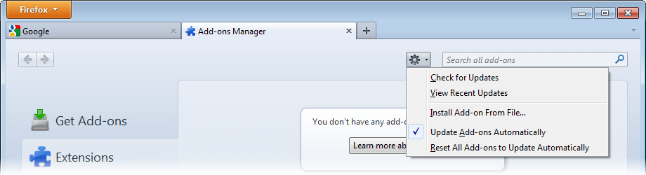
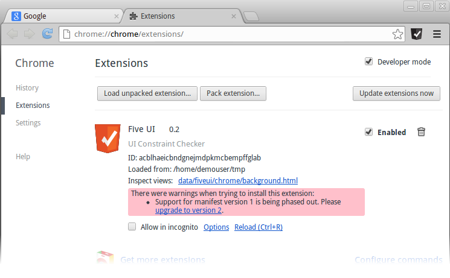

% Install Guide

# Installing the FiveUI Extension

FiveUI is distributed as source code and as a browser extension for
both Google Chrome and Mozilla Firefox.  This document describes the
install process for these browsers, assuming that you have the FiveUI
extension on your local computer.

## Installing FiveUI in Firefox

FiveUI is currently supported on Firefox 24 (Mozilla's extended support
release version).

The FiveUI Firefox extension is packaged in a file called
[`fiveui.xpi`][xpi].  Locate this file in your distribution (or download) and
take note of the location for the following steps.  We will assume
that it is located at `d:\binaries\fiveui.xpi`

[xpi]: ../binaries/fiveui.xpi

 * Open Firefox, and load the `Add-ons` from the main Firefox
   menu.


 * Within the `Add-ons Manager`, open the Gear menu and select
   `Install Add-on From File`.



 * A file dialog should open, use this to browse to the `fiveui.xpi`
   file (in our case, `d:\binaries\fiveui.xpi`).

 * Click OK, and a warning dialog should appear.  This dialog warns
   that the FiveUI author is not verified.  Because this is a
   development release of FiveUI, the xpi file is not
   cryptographically signed, and therefore, Firefox is unable to
   verify the author identification.

 * Click on the `Install Now` button once it becomes active.

FiveUI is now installed.  The [Getting Started guide](gettingStarted.html)
explains how to configure and use the extension.

## Installing FiveUI in Chrome

All recent versions of Google Chrome should support FiveUI.

Chrome is primarily designed to install extensions from the on-line
extension marketplace.  You can [install FiveUI] from that marketplace.
However, local extensions can also be installed by unpacking the
extension file, in this case [`fiveui_chrome.zip`][zip], and enabling
Chrome's extension developer mode.

[install FiveUI]: https://chrome.google.com/webstore/detail/five-ui/bbccaefdcbnnkpmekjchefnhhaamgoom
[zip]: ../binaries/fiveui_chrome.zip

The following steps describe how to install FiveUI in Chrome, using an
extension file from the local file system.

Download [`fiveui_chrome.zip`][zip] and take note of the location for
the following steps.  We will assume that it is located at
`d:\binaries\fiveui_chrome.zip`

 * Use your system's archive utility to unpack the zip file `fiveui_chrome.zip`.
 * Open Chrome and navigate to the extensions manager.  The extensions manager can be reached
   through Chrome's menu system or by entering ```chrome://extensions```
   in the URL bar.
 * Check the box labeled "Developer Mode" at the top of the extensions manager
   page (if it is not already checked):

    
 * Click "Load Unpacked Extension" and choose the directory where you unpacked
   the Chrome extension file. The directory should contain the file `manifest.json`.

    
 * The FiveUI extension should now appear in the extension manager and the
   FiveUI button should appear in the Chrome toolbar as shown:

    
 * **Note:** The warning message reading "Support for manifest version 1 is being phased out."
   is a known issue and does not currently affect the FiveUI extension.

FiveUI is now installed.  The [Getting Started guide](gettingStarted.html)
explains how to configure and use the extension.
